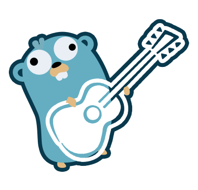

# NEWT

Backend escrito em Go

Para as rotas, veja o main.go

- As rotas de login e caso de teste NEWT usam token JWT
- As rotas do Colour Blind Test não usam JWT (Bem facil de add)

TODO: Adicionar o .SQL com a estrtura base do banco (Catar do PC que ficou o server)